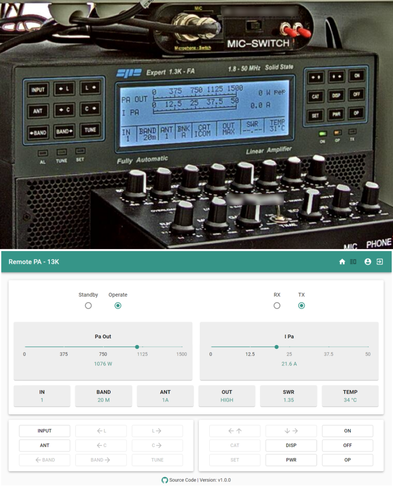

# FHNW Remote PA
A remote application for spe expert 1.3k-fa amateur radio amplifier.
Connect your power amplifier via the USB port to the Raspberry Pi and start the web server to control your device from remote.

## Contributors
* see [CONTRIBUTORS](src/CONTRIBUTORS.md)

## Documentation
* for developer information see [DEVELOPER GUIDE](src/DEVELOPER.md)
* for user manual see [USER MANUAL](src/SETUP.md) (how to run application on server)

## License
This project is licensed under the MIT License, see [LICENSE](LICENSE).
